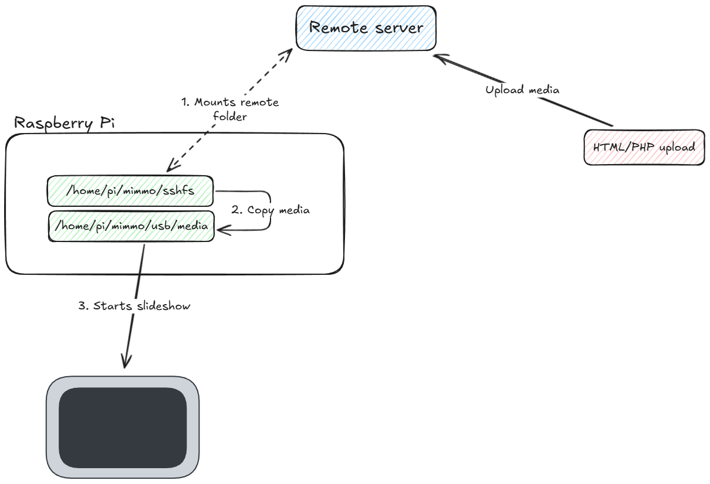

# Mimmo (Simple Raspberry Pi slideshow)



**This is documentation for how to set it up, it is not plug and play and you will have to look at the code to make the necessary modifications**

## The What

It's a collection of files that ultimately make the Pi do this:
1. Upload media using ssh or using a web page (provided)
2. Mounts a remote folder containing media
3. Saves the media in a folder on a USB stick
4. Start a slideshow using that folder as the source


## The Why

Why did I create this?

I have family all over, and with most I communicate through WhatsApp and we all share pictures in the family group. The part of the family that is left out is completely tech-averse and making them using an old mobile phone is already too much to ask.

I wanted to gift them something that you just plug into the power socket and without touching anything it would show pictures.

## The How

So how would something like this work?

My requirements were:
- **No interaction with an interface**: Boot > show the pictures. That's it.
- **Self-updating**: When I "send" a picture, it has to somehow show it.

I settled on using a Raspberry Pi and connecting it to their TV.

The TV is the **one** device they know how to use: volume up/down, changing channels, and... **change the source**! All the interaction that should be needed:
1. Plug the Pi into the power
2. Change the TV source to the Pi

## Technical details

How would something like this work from a technical perspective?

The software/hardware needed is: 
- `rsync`: for efficient copying
- `vlc`: for the slideshow
- `sshfs`: for mounting a remote machines folder as a local filesystem
- an external USB stick formatted as ext4: for saving the media here

For the videos, I found that the Pi has no problem with showing videos using the H264 codec @ 30fps. So I would stick to that.


### Assumptions

The project assumes the following:
- Project folder is `/home/pi/mimmo`
- Internet access is already configured
- SSH keys and SSH access to the remote server containing media is configured
- A folder `/home/pi/sshfs` for the remote folder mount
- A folder `/home/pi/mimmo/usb` for the USB stick mount. Possible `fstab` config:
```
/dev/sda1 /home/pi/mimmo/usb ext4 defaults,nofail 0 2
```


### Provided files

`display.desktop`: Config to apply in `/etc/xdg/autostart/display.desktop` for executing `script.sh` at boot
`script.sh`: Does the whole shebang
`web/index.php`: Minimalist page to be able to upload files from a web interface
`web/upload.php`: Script that's responsible for handling the media upload

The php files are completely optional, I just created them so it's easier for me and others to upload photos and videos.

**IMPORTANT**: The php files are NOT secured in any way! I use **Basic Auth** over HTTPS to prevent access to these these files!

**IMPORTANT**: I recommend to save the uploaded files **outside** of a publicly accessible folder. Up to you to configure it!

I tried to document the files as much as possible. CHANGES HAVE TO BE MADE

### (Possible) changes to be made to the files

`display.desktop`: Point to the correct location of `script.sh`
`script.sh`: Double check the mount folders and change the sshfs `USER` and `SERVER`
`web/index.php`: Change the how-to-use for less tech-savvy users
`web/upload.php`: Change the upload dir and eventually other parameters


## Potentially asked questions

_**How do you turn off the Pi?**_
By pulling the power cord. To prevent damage or corruption I configured the OverlayFS found in the `raspi-config`.

_**Why store the media on a USB and not on the MicroSD card?**_
After setting up the Pi correctly I enable the OverlayFS and read-only mode for the MicroSD card. This way if you pull the Pi out of the power socket it won't damage or corrupt the SD card. I format the USB stick as ext4 because it's also better against sudden power outages.

_**Why format the USB as ext4? Why not NTFS or something else?**_
Initially I had it as NTFS, but it was not advised for power outages, and because Linux handles ext4 better.

_**Why save the media locally?**_
Why save the media locally? Can't you just show the slideshow by mounting the remote folder and using that? In theory *yes*, but I prefer saving the media locally so that it does not have to download the media everytime they use it, and in this case even without internet, the Pi will be able to show the slideshow

_**How do I order the slideshow in descending order?**_
In the `web/upload.php` I use a "reverse timestamp" ordering method, where I save the file with a prefix like this: `timestamp of 2100-01-01 - current timestamp). This way in an ascending-order, the last uploaded file will be at the top.

## Customizations

For customizing the pi a bit:
- `splash.png` (the splash image during boot): copy to /usr/share/plymouth/themes/pix (https://forums.raspberrypi.com/viewtopic.php?p=2146795&sid=345d6911e58b1c0b897dabf3b9557475#p2146795)
- `background.jpg` (the background image you will see between the boot and the start of the slideshow) (https://raspberrypi.stackexchange.com/a/106023, also read comment)


## Handy links:
Setting up the boot script: https://lasplo.hu/raspberry-pi-run-vlc-on-startup-and-play-slideshow-videos-and-pictures-from-folder/

for display disconnecting when switching hdmi (didn't need, but could be handy):
- https://forums.raspberrypi.com/viewtopic.php?t=219854
- https://stackoverflow.com/questions/20887896/video-output-from-raspberry-pi-stops-after-a-while
- https://github.com/raspberrypi/firmware/issues/1647
- https://forums.raspberrypi.com/viewtopic.php?t=129867